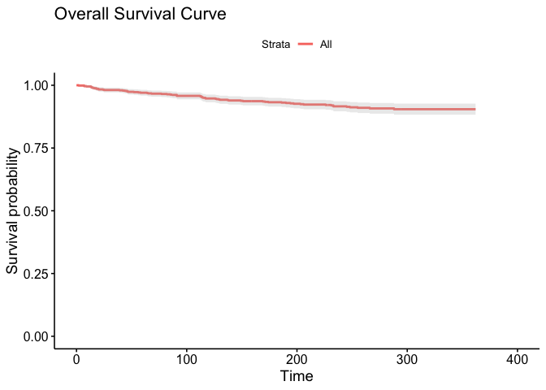
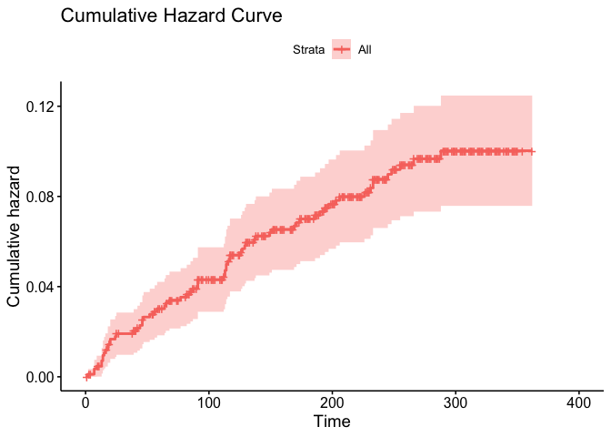
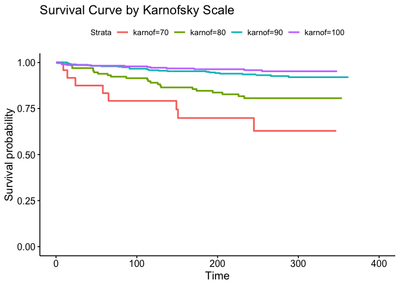
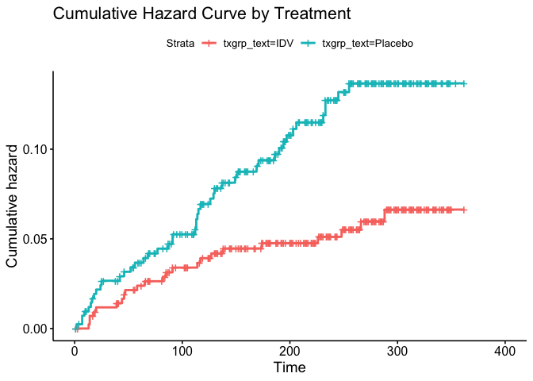
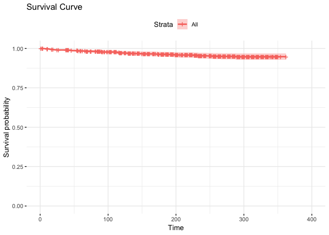
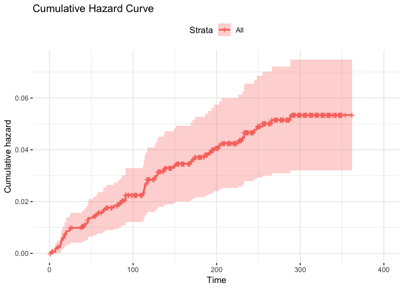

```r
KM <- survfit(Surv(time, censor)~1, data=aids)
ggsurvplot(KM, conf.int=TRUE, censor=F) + ggtitle("Overall Survival Curve")
```

<!-- -->

```r
ggsurvplot(KM, fun="cumhaz") + ggtitle("Cumulative Hazard Curve")
```

<!-- -->

```r
KM <- survfit(Surv(time, censor)~txgrp_text, type="kaplan-meier", conf.type="log", data=aids)
ggsurvplot(KM, conf.int=TRUE, censor=F) + ggtitle("Survival Curve by Treatment")
```

<!-- -->

```r
ggsurvplot(KM, fun="cumhaz") + ggtitle("Cumulative Hazard Curve by Treatment")
```

<!-- -->


```r
covariates <- c("txgrp", "sex",  "raceth", "ivdrug", "hemophil", "karnof", "cd4", "priorzdv", "age")
univ_formulas <- sapply(covariates,
                        function(x) as.formula(paste('Surv(time, censor)~', x)))
univ_models <- lapply( univ_formulas, function(x){coxph(x, data = aids)})
# Extract data 
univ_results <- lapply(univ_models,
                       function(x){ 
                          x <- summary(x)
                          p.value<-signif(x$wald["pvalue"], digits=2)
                          wald.test<-signif(x$wald["test"], digits=2)
                          beta<-signif(x$coef[1], digits=2);#coeficient beta
                          HR <-signif(x$coef[2], digits=2);#exp(beta)
                          HR.confint.lower <- signif(x$conf.int[,"lower .95"], 2)
                          HR.confint.upper <- signif(x$conf.int[,"upper .95"],2)
                          HR <- paste0(HR, " (", 
                                       HR.confint.lower, "-", HR.confint.upper, ")")
                          res<-c(beta, HR, wald.test, p.value)
                          names(res)<-c("beta", "HR (95% CI for HR)", "wald.test", 
                                        "p.value")
                          return(res)
                          #return(exp(cbind(coef(x),confint(x))))
                         })
res <- t(as.data.frame(univ_results, check.names = FALSE))
as.data.frame(res)
```

```
##             beta HR (95% CI for HR) wald.test p.value
## txgrp      -0.76   0.47 (0.28-0.77)       8.9  0.0028
## sex          0.2     1.2 (0.65-2.3)      0.39    0.53
## raceth    0.0036       1 (0.77-1.3)         0    0.98
## ivdrug     -0.13    0.88 (0.62-1.2)      0.52    0.47
## hemophil    0.27     1.3 (0.41-4.2)      0.21    0.65
## karnof    -0.081    0.92 (0.9-0.95)        34 6.9e-09
## cd4       -0.017   0.98 (0.98-0.99)        32 1.9e-08
## priorzdv -0.0032         1 (0.99-1)      0.48    0.49
## age        0.017         1 (0.99-1)       1.8    0.18
```
The individual covariates txgrp, karnof, and cd4 have significant correlation coefficients. The order of covariates in order of most to least significant is karnof, cd4, txgrp, age, ivdrug, prior zdv, sex, hemophil and raceth. A multivariate model will be fit with the three significant covariates. 

```r
cox <- coxph(Surv(time,censor) ~ txgrp, data = aids)
summary(cox)
```

```
## Call:
## coxph(formula = Surv(time, censor) ~ txgrp, data = aids)
## 
##   n= 851, number of events= 69 
## 
##          coef exp(coef) se(coef)      z Pr(>|z|)   
## txgrp -0.7622    0.4666   0.2554 -2.984  0.00284 **
## ---
## Signif. codes:  0 '***' 0.001 '**' 0.01 '*' 0.05 '.' 0.1 ' ' 1
## 
##       exp(coef) exp(-coef) lower .95 upper .95
## txgrp    0.4666      2.143    0.2828    0.7698
## 
## Concordance= 0.591  (se = 0.029 )
## Rsquare= 0.011   (max possible= 0.655 )
## Likelihood ratio test= 9.48  on 1 df,   p=0.002
## Wald test            = 8.91  on 1 df,   p=0.003
## Score (logrank) test = 9.34  on 1 df,   p=0.002
```

```r
pchisq((-2*cox$loglik[1])-(-2*cox$loglik[2]), d=1, lower.tail = FALSE)
```

```
## [1] 0.002073565
```
The LRT for adding in txgrp as a variable results in a p-value of 0.002, so it is included in the model. 


```r
cox1 <- coxph(Surv(time,censor) ~ txgrp + karnof, data = aids)
#summary(cox1)
#cox1 %>% tidy()
pchisq((-2*cox$loglik[2])-(-2*cox1$loglik[2]), d=1, lower.tail = FALSE)
```

```
## [1] 1.320752e-08
```
The LRT for adding in karnof as a variable results in a p-value of 1.320752e-08, so it is included in the model. 


```r
cox2 <- coxph(Surv(time,censor) ~ txgrp + karnof + cd4, data = aids)
summary(cox2)
```

```
## Call:
## coxph(formula = Surv(time, censor) ~ txgrp + karnof + cd4, data = aids)
## 
##   n= 851, number of events= 69 
## 
##             coef exp(coef)  se(coef)      z Pr(>|z|)    
## txgrp  -0.680710  0.506258  0.256155 -2.657  0.00787 ** 
## karnof -0.057422  0.944195  0.013804 -4.160 3.18e-05 ***
## cd4    -0.014622  0.985485  0.003074 -4.757 1.97e-06 ***
## ---
## Signif. codes:  0 '***' 0.001 '**' 0.01 '*' 0.05 '.' 0.1 ' ' 1
## 
##        exp(coef) exp(-coef) lower .95 upper .95
## txgrp     0.5063      1.975    0.3064    0.8364
## karnof    0.9442      1.059    0.9190    0.9701
## cd4       0.9855      1.015    0.9796    0.9914
## 
## Concordance= 0.791  (se = 0.026 )
## Rsquare= 0.085   (max possible= 0.655 )
## Likelihood ratio test= 75.21  on 3 df,   p=3e-16
## Wald test            = 61.56  on 3 df,   p=3e-13
## Score (logrank) test = 71.72  on 3 df,   p=2e-15
```

```r
cox2 %>% tidy()
```

```
## # A tibble: 3 x 7
##   term   estimate std.error statistic    p.value conf.low conf.high
##   <chr>     <dbl>     <dbl>     <dbl>      <dbl>    <dbl>     <dbl>
## 1 txgrp   -0.681    0.256       -2.66 0.00787     -1.18    -0.179  
## 2 karnof  -0.0574   0.0138      -4.16 0.0000318   -0.0845  -0.0304 
## 3 cd4     -0.0146   0.00307     -4.76 0.00000197  -0.0206  -0.00860
```

```r
pchisq((-2*cox1$loglik[2])-(-2*cox2$loglik[2]), d=1, lower.tail = FALSE)
```

```
## [1] 7.403133e-09
```
The LRT for adding in cd4 as a variable results in a p-value of 7.403133e-09, so it is included in the model. 


```r
cox3 <- coxph(Surv(time,censor) ~ txgrp + karnof + cd4 + age, data = aids)
summary(cox3)
```

```
## Call:
## coxph(formula = Surv(time, censor) ~ txgrp + karnof + cd4 + age, 
##     data = aids)
## 
##   n= 851, number of events= 69 
## 
##             coef exp(coef)  se(coef)      z Pr(>|z|)    
## txgrp  -0.697081  0.498037  0.256341 -2.719  0.00654 ** 
## karnof -0.055892  0.945641  0.013894 -4.023 5.75e-05 ***
## cd4    -0.015127  0.984987  0.003128 -4.836 1.32e-06 ***
## age     0.021280  1.021508  0.013809  1.541  0.12331    
## ---
## Signif. codes:  0 '***' 0.001 '**' 0.01 '*' 0.05 '.' 0.1 ' ' 1
## 
##        exp(coef) exp(-coef) lower .95 upper .95
## txgrp     0.4980     2.0079    0.3013    0.8231
## karnof    0.9456     1.0575    0.9202    0.9717
## cd4       0.9850     1.0152    0.9790    0.9910
## age       1.0215     0.9789    0.9942    1.0495
## 
## Concordance= 0.792  (se = 0.026 )
## Rsquare= 0.087   (max possible= 0.655 )
## Likelihood ratio test= 77.51  on 4 df,   p=6e-16
## Wald test            = 61.94  on 4 df,   p=1e-12
## Score (logrank) test = 72.69  on 4 df,   p=6e-15
```

```r
cox3 %>% tidy()
```

```
## # A tibble: 4 x 7
##   term   estimate std.error statistic    p.value conf.low conf.high
##   <chr>     <dbl>     <dbl>     <dbl>      <dbl>    <dbl>     <dbl>
## 1 txgrp   -0.697    0.256       -2.72 0.00654    -1.20     -0.195  
## 2 karnof  -0.0559   0.0139      -4.02 0.0000575  -0.0831   -0.0287 
## 3 cd4     -0.0151   0.00313     -4.84 0.00000132 -0.0213   -0.00900
## 4 age      0.0213   0.0138       1.54 0.123      -0.00579   0.0483
```

```r
pchisq((-2*cox2$loglik[2])-(-2*cox3$loglik[2]), d=1, lower.tail = FALSE)
```

```
## [1] 0.1295928
```
The LRT for adding in age as a variable results in a p-value of .13, so it is not included in the model. Cox2 is the best model using forward selection. 


```r
ggsurvplot(survfit(cox2), data=aids, ggtheme = theme_minimal()) + ggtitle ("Survival Curve")
```

<!-- -->

```r
ggsurvplot(survfit(cox2), data=aids, ggtheme = theme_minimal(), fun="cumhaz") + ggtitle("Cumulative Hazard Curve")
```

<!-- -->

