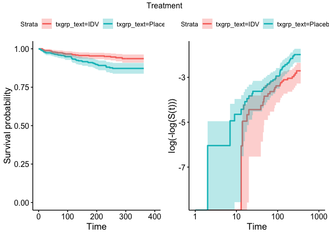

Investigation of the proportional hazards assumption (what does the R function cox.zph do?).

Investigating the proportional hazards assumption relates to the survival analysis because the Cox PH model technical conditions include the proportional hazards assumption. If the assumption does not hold, the model could be inaccurate. The resources I plan to use to investigate the assumption include R documentation of the cox.zph function, and understanding what the function is doing to calculate the p-values of the covariates. 

why lrt doesn't work and how to deal with it. 


<!-- --><!-- --><!-- --><!-- --><!-- --><!-- --><!-- --><!-- --><!-- --><!-- -->
Because the complimentary log log curves do not cross, the proportional hazards assumption holds for different treatment groups. 


<!-- --><!-- -->


```
##             beta HR (95% CI for HR) wald.test p.value
## txgrp      -0.76   0.47 (0.28-0.77)       8.9  0.0028
## sex          0.2     1.2 (0.65-2.3)      0.39    0.53
## raceth    0.0036       1 (0.77-1.3)         0    0.98
## ivdrug     -0.13    0.88 (0.62-1.2)      0.52    0.47
## hemophil    0.27     1.3 (0.41-4.2)      0.21    0.65
## karnof    -0.081    0.92 (0.9-0.95)        34 6.9e-09
## cd4       -0.017   0.98 (0.98-0.99)        32 1.9e-08
## priorzdv -0.0032         1 (0.99-1)      0.48    0.49
## age        0.017         1 (0.99-1)       1.8    0.18
```
The individual covariates txgrp, karnof, and cd4 have significant correlation coefficients. The order of covariates in order of most to least significant is karnof, cd4, txgrp, age, ivdrug, prior zdv, sex, hemophil and raceth. A multivariate model will be fit with the three significant covariates. 

```r
cox <- coxph(Surv(time,censor) ~ txgrp, data = aids)
cox %>% tidy()
```

```
## # A tibble: 1 x 7
##   term  estimate std.error statistic p.value conf.low conf.high
##   <chr>    <dbl>     <dbl>     <dbl>   <dbl>    <dbl>     <dbl>
## 1 txgrp   -0.762     0.255     -2.98 0.00284    -1.26    -0.262
```

```r
pchisq((-2*cox$loglik[1])-(-2*cox$loglik[2]), d=1, lower.tail = FALSE)
```

```
## [1] 0.002073565
```
The LRT for adding in txgrp as a variable results in a p-value of 0.002, so it is included in the model. 


```r
cox1 <- coxph(Surv(time,censor) ~ txgrp + karnof, data = aids)
cox1 %>% tidy()
```

```
## # A tibble: 2 x 7
##   term   estimate std.error statistic       p.value conf.low conf.high
##   <chr>     <dbl>     <dbl>     <dbl>         <dbl>    <dbl>     <dbl>
## 1 txgrp   -0.797     0.255      -3.12 0.00181         -1.30    -0.296 
## 2 karnof  -0.0805    0.0137     -5.89 0.00000000396   -0.107   -0.0537
```

```r
pchisq((-2*cox$loglik[2])-(-2*cox1$loglik[2]), d=1, lower.tail = FALSE)
```

```
## [1] 1.320752e-08
```
The LRT for adding in karnof as a variable results in a p-value of 1.320752e-08, so it is included in the model.


```r
cox2 <- coxph(Surv(time,censor) ~ txgrp + karnof + cd4, data = aids)
cox2 %>% tidy()
```

```
## # A tibble: 3 x 7
##   term   estimate std.error statistic    p.value conf.low conf.high
##   <chr>     <dbl>     <dbl>     <dbl>      <dbl>    <dbl>     <dbl>
## 1 txgrp   -0.681    0.256       -2.66 0.00787     -1.18    -0.179  
## 2 karnof  -0.0574   0.0138      -4.16 0.0000318   -0.0845  -0.0304 
## 3 cd4     -0.0146   0.00307     -4.76 0.00000197  -0.0206  -0.00860
```

```r
pchisq((-2*cox1$loglik[2])-(-2*cox2$loglik[2]), d=1, lower.tail = FALSE)
```

```
## [1] 7.403133e-09
```
The LRT for adding in cd4 as a variable results in a p-value of 7.403133e-09, so it is included in the model. 


```r
cox3 <- coxph(Surv(time,censor) ~ txgrp + karnof + cd4 + age, data = aids)
cox3 %>% tidy()
```

```
## # A tibble: 4 x 7
##   term   estimate std.error statistic    p.value conf.low conf.high
##   <chr>     <dbl>     <dbl>     <dbl>      <dbl>    <dbl>     <dbl>
## 1 txgrp   -0.697    0.256       -2.72 0.00654    -1.20     -0.195  
## 2 karnof  -0.0559   0.0139      -4.02 0.0000575  -0.0831   -0.0287 
## 3 cd4     -0.0151   0.00313     -4.84 0.00000132 -0.0213   -0.00900
## 4 age      0.0213   0.0138       1.54 0.123      -0.00579   0.0483
```

```r
pchisq((-2*cox2$loglik[2])-(-2*cox3$loglik[2]), d=1, lower.tail = FALSE)
```

```
## [1] 0.1295928
```
The LRT for adding in age as a variable results in a p-value of .13, so it is not included in the model. Cox2 is the best model using forward selection. Next, I will create a model where cd4 is split into factors to see if it shoud be a categorical or continuous variable. 


```r
cox4 <- coxph(Surv(time,censor) ~ txgrp + karnof + cd4f, data = aids)
cox4 %>% tidy()
```

```
## # A tibble: 6 x 7
##   term        estimate std.error statistic    p.value conf.low conf.high
##   <chr>          <dbl>     <dbl>     <dbl>      <dbl>    <dbl>     <dbl>
## 1 txgrp        -0.694     0.256      -2.72 0.00662     -1.20     -0.193 
## 2 karnof       -0.0625    0.0138     -4.52 0.00000608  -0.0896   -0.0354
## 3 cd4f50-100   -0.310     0.298      -1.04 0.299       -0.895     0.275 
## 4 cd4f100-150  -2.94      1.01       -2.90 0.00368     -4.92     -0.956 
## 5 cd4f150-200  -2.39      1.01       -2.36 0.0181      -4.38     -0.409 
## 6 cd4fover200  -1.90      1.01       -1.87 0.0609      -3.89      0.0866
```

```r
pchisq((-2*cox1$loglik[2])-(-2*cox4$loglik[2]), d=6, lower.tail = FALSE)
```

```
## [1] 2.559148e-06
```
The p-value of 2.559148e-06 shows that the cd4 categories should be included in the model. Now, I will consider interaction between cd4f and the other two variables. 


```r
-1.89993881--2.39426985
```

```
## [1] 0.494331
```

```r
-2.39426985--2.93830829
```

```
## [1] 0.5440384
```

```r
-2.93830829--0.31005778
```

```
## [1] -2.628251
```
The log(HR) will be linear in cd4 if it should be linear. Thus, $e^{b_2}/e^{b_1}=e^{b_3}/e^{b_2}=e^{b_4}/e^{b_3}$, so $b_2-b_1=b_3-b_2=b_4-b_3$. because there are constant 50 cd4 gaps between the groups. The relationship holds for the upper 3 cd4 factors, but the value from moving from the lowest to the next lowest cd4 group is -2.628251 as compared to around 0.5, so cd4 should be kept as factors. Next, I will create models with interaction. 


```r
cox5 <- coxph(Surv(time,censor) ~ txgrp + karnof*cd4f, data = aids)
```

```
## Warning in fitter(X, Y, strats, offset, init, control, weights = weights, :
## Loglik converged before variable 4,5,8,9 ; beta may be infinite.
```

```r
cox5 %>% tidy()
```

```
## # A tibble: 10 x 7
##    term          estimate std.error statistic   p.value  conf.low conf.high
##    <chr>            <dbl>     <dbl>     <dbl>     <dbl>     <dbl>     <dbl>
##  1 txgrp          -0.661    2.56e-1  -2.58      9.91e-3   -1.16     -0.159 
##  2 karnof         -0.0762   1.54e-2  -4.94      7.69e-7   -0.106    -0.0460
##  3 cd4f50-100     -5.59     3.46e+0  -1.62      1.06e-1  -12.4       1.19  
##  4 cd4f100-150  -170.       2.86e+4  -0.00596   9.95e-1 -Inf       Inf     
##  5 cd4f150-200  -176.       3.99e+4  -0.00442   9.96e-1 -Inf       Inf     
##  6 cd4fover200    -0.611    1.37e+1  -0.0448    9.64e-1  -27.4      26.2   
##  7 karnof:cd4f…    0.0595   3.82e-2   1.56      1.20e-1   -0.0155    0.134 
##  8 karnof:cd4f…    1.69     2.86e+2   0.00592   9.95e-1 -558.      562.    
##  9 karnof:cd4f…    1.76     3.99e+2   0.00440   9.96e-1 -Inf       Inf     
## 10 karnof:cd4f…   -0.0133   1.51e-1  -0.0880    9.30e-1   -0.310     0.284
```

```r
pchisq((-2*cox4$loglik[2])-(-2*cox5$loglik[2]), d=6, lower.tail = FALSE)
```

```
## [1] 0.2164783
```
The p-value of 0.2164783 indicates that interaction between karnof and cd4f is not necessary in the model. 


```r
cox6 <- coxph(Surv(time,censor) ~ txgrp*cd4f + karnof + cd4f, data = aids)
```

```
## Warning in fitter(X, Y, strats, offset, init, control, weights = weights, :
## Loglik converged before variable 3,4,5,8,9,10 ; beta may be infinite.
```

```r
cox6 %>% tidy()
```

```
## # A tibble: 10 x 7
##    term          estimate  std.error statistic  p.value  conf.low conf.high
##    <chr>            <dbl>      <dbl>     <dbl>    <dbl>     <dbl>     <dbl>
##  1 txgrp          -0.664      0.298   -2.23     2.57e-2   -1.25     -0.0805
##  2 cd4f50-100      0.199      0.894    0.222    8.24e-1   -1.55      1.95  
##  3 cd4f100-150   -36.2     8547.      -0.00423  9.97e-1 -Inf       Inf     
##  4 cd4f150-200    14.8     4988.       0.00296  9.98e-1 -Inf       Inf     
##  5 cd4fover200   -37.2    14236.      -0.00262  9.98e-1 -Inf       Inf     
##  6 karnof         -0.0622     0.0138  -4.49     7.08e-6   -0.0893   -0.0351
##  7 txgrp:cd4f50…  -0.391      0.656   -0.595    5.52e-1   -1.68      0.895 
##  8 txgrp:cd4f10…  17.0     4273.       0.00399  9.97e-1 -Inf       Inf     
##  9 txgrp:cd4f15… -16.6     4988.      -0.00334  9.97e-1 -Inf       Inf     
## 10 txgrp:cd4fov…  18.1     7118.       0.00254  9.98e-1 -Inf       Inf
```

```r
pchisq((-2*cox4$loglik[2])-(-2*cox6$loglik[2]), d=6, lower.tail = FALSE)
```

```
## [1] 0.5398977
```
The p-value of 0.5398977 indicates that interaction between txgrp and cd4 is not needed in the model. 

```r
ggsurvplot(survfit(cox2), data=aids, ggtheme = theme_minimal()) + ggtitle ("Survival Curve")
```

<!-- -->

```r
ggsurvplot(survfit(cox2), data=aids, ggtheme = theme_minimal(), fun="cumhaz") + ggtitle("Cumulative Hazard Curve")
```

<!-- -->
