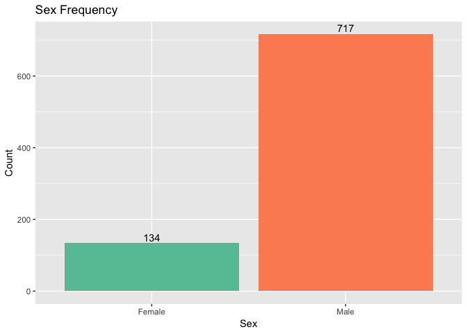
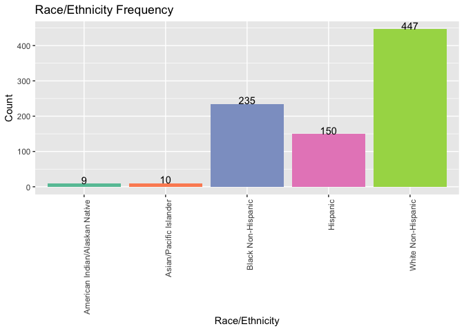
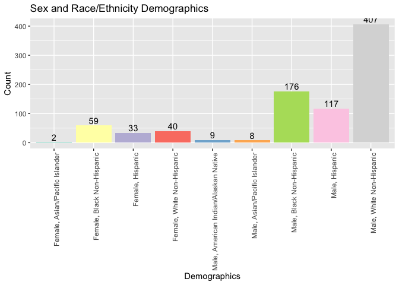
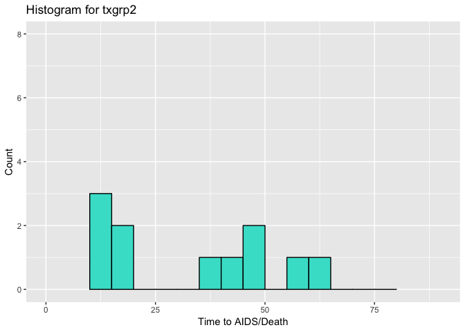

Adding a new column in dataframe for combined sex/raceth demographics.

11 = male, white non-hispanic
12 = male, black non-hispanic
13 = male, hispanic
14 = male, asian/pacific islander
15 = male, american indian/alaska native
16 = male, other/unknown
21 = female, white non-hispanic
22 = female, black non-hispanic
23 = female, hispanic
24 = female, asian/pacific islander
25 = female, american indian/alaska native
26 = female, other/unknown

```r
#Changing data from numerical to text
aids$censor_text <- NA
aids$censor_d_text <- NA
aids$txgrp_text <- NA
aids$strat2_text <- NA
aids$sex_text <- NA
aids$raceth_text <- NA
aids$ivdrug_text <- NA
aids$hemophil_text <- NA
aids$demo <- NA
aids$demo_text <- NA
```


```r
for (elt in 1:length(aids$id)) {
  s = toString(aids$sex[elt])
  r = toString(aids$raceth[elt])
  aids$demo[elt] <- as.numeric(paste (s, r, sep=''))
  
  if (aids$censor[elt] == 1) {
    aids$censor_text[elt] <- 'AIDS/death'
  } else {
    aids$censor_text[elt] <- 'Otherwise'
  }
  
  if (aids$censor_d[elt] == 1) {
    aids$censor_d_text[elt] <- 'Death'
  } else {
    aids$censor_d_text[elt] <- 'Otherwise'
  }
  
  if (aids$txgrp[elt] == 1) {
    aids$txgrp_text[elt] <- 'Placebo'
  } else {
    aids$txgrp_text[elt] <- 'IDV'
  }
  
  if (aids$strat2[elt] == 1) {
    aids$strat2_text[elt] <- 'CD4 <= 50'
  } else {
    aids$strat2_text[elt] <- 'CD4 > 50'
  }
  
  if (aids$sex[elt] == 1) {
    aids$sex_text[elt] <- 'Male'
  } else {
    aids$sex_text[elt] <- 'Female'
  }
  
  if (aids$raceth[elt] == 1) {
    aids$raceth_text[elt] <- 'White Non-Hispanic'
  } else if (aids$raceth[elt] == 2) {
    aids$raceth_text[elt] <- 'Black Non-Hispanic'
  } else if (aids$raceth[elt] == 3) {
    aids$raceth_text[elt] <- 'Hispanic'
  } else if (aids$raceth[elt] == 4) {
    aids$raceth_text[elt] <- 'Asian/Pacific Islander'
  } else if (aids$raceth[elt] == 5) {
    aids$raceth_text[elt] <- 'American Indian/Alaskan Native'
  } else if (aids$raceth[elt] == 6) {
    aids$raceth_text[elt] <- 'Other/Unknown'
  }
  
  if (aids$ivdrug[elt] == 1) {
    aids$ivdrug_text[elt] <- 'Never'
  } else if (aids$ivdrug[elt] == 2) {
    aids$ivdrug_text[elt] <- 'Currently'
  } else if (aids$ivdrug[elt] == 3) {
    aids$ivdrug_text[elt] <- 'Previously'
  }
  
  if (aids$hemophil[elt] == 1) {
    aids$hemophil_text[elt] <- 'Yes'
  } else if (aids$hemophil[elt] == 0) {
    aids$hemophil_text[elt] <- 'No'
  }
  
  aids$demo_text[elt] <- (paste (aids$sex_text[elt], aids$raceth_text[elt], sep=', '))
}
```


```r
dfTab <- as.data.frame(table(aids$sex_text))
colnames(dfTab)[1] <- "n"
dfTab$lab <- as.character(100 * dfTab$Freq / sum(dfTab$Freq))

ggplot(aids, aes(x=sex_text, fill=sex_text)) + geom_bar( ) +
  scale_fill_brewer(palette = "Set2") + labs(title = 'Sex Frequency', x = "Sex", y = "Count") + theme(legend.position = "none") + geom_text(data=dfTab, aes(n, Freq, label = Freq), vjust=0, inherit.aes = FALSE)
```

<!-- -->

```r
dfTab <- as.data.frame(table(aids$raceth_text))
colnames(dfTab)[1] <- "n"
dfTab$lab <- as.character(100 * dfTab$Freq / sum(dfTab$Freq))

ggplot(aids, aes(x=raceth_text, fill=raceth_text)) + geom_bar( ) +
  scale_fill_brewer(palette = "Set2") + labs(title = 'Race/Ethnicity Frequency', x = "Race/Ethnicity", y = "Count") +  theme(legend.position = "none") + theme(axis.text.x = element_text(angle = 90, hjust = 1)) + geom_text(data=dfTab, aes(n, Freq, label = Freq), vjust=0, inherit.aes = FALSE)
```

<!-- -->

```r
dfTab <- as.data.frame(table(aids$demo_text))
colnames(dfTab)[1] <- "n"
dfTab$lab <- as.character(100 * dfTab$Freq / sum(dfTab$Freq))

ggplot(aids, aes(x=demo_text, fill=demo_text)) + geom_bar( ) +
  scale_fill_brewer(palette = "Set3") + labs(title = 'Sex and Race/Ethnicity Demographics', x = "Demographics", y = "Count") + theme(axis.text.x = element_text(angle = 90, hjust = 1)) + theme(legend.position = "none") + geom_text(data=dfTab, aes(n, Freq, label = Freq), vjust=0, inherit.aes = FALSE)
```

<!-- -->
```

```r
ggplot(aids, aes(x=age)) + geom_histogram(breaks=seq(10, 80, by=5), col='black', fill='turquoise') + 
  labs(title="Histogram for Age", x="Age", y="Count") + 
  xlim(c(10,80)) + ylim(c(0,450))
```

<!-- -->


```r
ggplot(aids %>% filter(txgrp == 1 & censor == 1), aes(x=time)) + geom_histogram(breaks=seq(10, 80, by=5), col='black', fill='turquoise') + 
  labs(title="Histogram for txgrp1", x="Time to AIDS/Death", y="Count") + 
  xlim(c(0,90)) + ylim(c(0,8))
```

```
## Warning: Removed 27 rows containing non-finite values (stat_bin).
```

<!-- -->

```r
ggplot(aids %>% filter(txgrp == 2 & censor == 1), aes(x=time)) + geom_histogram(breaks=seq(10, 80, by=5), col='black', fill='turquoise') + 
  labs(title="Histogram for txgrp2", x="Time to AIDS/Death", y="Count") + 
  xlim(c(0,90)) + ylim(c(0,8))
```

```
## Warning: Removed 10 rows containing non-finite values (stat_bin).
```

<!-- -->

```r
#subjects stratified by CD4
table(aids$txgrp_text, aids$strat2_text)
```

```
##          
##           CD4 <= 50 CD4 > 50
##   IDV           266      163
##   Placebo       258      164
```

```r
#higher proportion of CD4>50 die
table(aids$strat2_text, aids$censor_text)
```

```
##            
##             AIDS/death Otherwise
##   CD4 <= 50         21       503
##   CD4 > 50          48       279
```

```r
#lower proportion of AIDS/death with IDV
table(aids$txgrp_text, aids$censor_text)
```

```
##          
##           AIDS/death Otherwise
##   IDV             23       406
##   Placebo         46       376
```

```r
#lower proportion of death with IDV
table(aids$txgrp_text, aids$censor_d_text)
```

```
##          
##           Death Otherwise
##   IDV         6       423
##   Placebo    14       408
```

```r
#iv use and AIDS/death
table(aids$ivdrug_text, aids$censor_text)
```

```
##             
##              AIDS/death Otherwise
##   Currently           0         2
##   Never              60       655
##   Previously          9       125
```

```r
#hemphilia and AIDS/death
table(aids$hemophil_text, aids$censor_text)
```

```
##      
##       AIDS/death Otherwise
##   No          66       756
##   Yes          3        26
```

