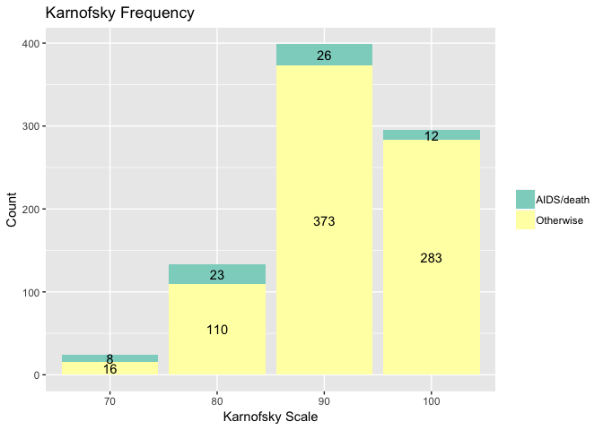
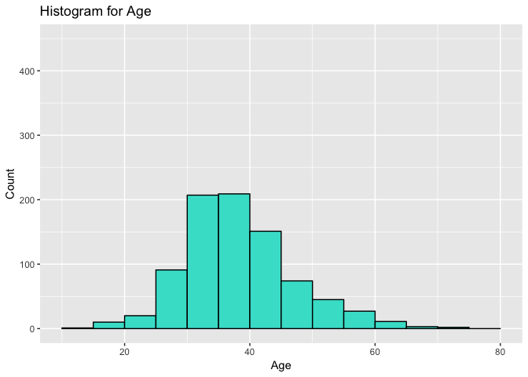
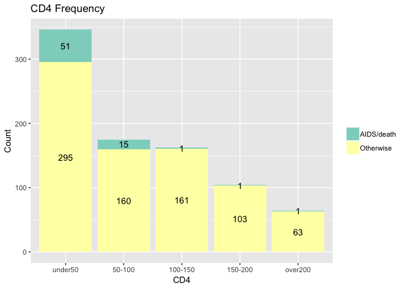

<!-- -->

```
## 
## 	Chi-squared test for given probabilities
## 
## data:  table(aids$sex_text)
## X-squared = 399.4, df = 1, p-value < 2.2e-16
```
From the p-value of 2.2e-16 in a chi-squared test of proportions, there is a statistically significant difference in the proportion of men enrolled in the study to women.


<!-- -->

```
## 
## 	Chi-squared test for given probabilities
## 
## data:  table(aids$raceth_text)
## X-squared = 780.7, df = 4, p-value < 2.2e-16
```
From the p-value of 2.2e-16 in a chi-squared test of proportions, there is a statistically significant difference in the proportion of race/ethnicity groups enrolled in the study.

<!-- -->

```
## 
## 	Chi-squared test for given probabilities
## 
## data:  table(aids$demo_text)
## X-squared = 1440.1, df = 8, p-value < 2.2e-16
```
From the p-value of 2.2e-16 in a chi-squared test of proportions, there is a statistically significant difference in the proportion of gender+race/ethnicity groups enrolled in the study.


<!-- -->

```
## Warning in chisq.test(aids$censor_text, aids$karnof): Chi-squared
## approximation may be incorrect
```

```
## 
## 	Pearson's Chi-squared test
## 
## data:  aids$censor_text and aids$karnof
## X-squared = 43.377, df = 3, p-value = 2.047e-09
```

The p-value of 2.047e-09 indicates that there is a significant difference in the proportion of individuals who develop AIDS or die across the different Karnofsky scale groups.

<!-- -->

<!-- -->
The largest cd4 in the study is 348. The CDC states that any cd4 under 200 clinically defines HIV, and cd4 over 500 is considered healthy. Initially, when infected with HIV, cd4 count typically drops to around 500 and tends to decline as the disease progresses. The risk of aids double for every 100 cells/mm^3 drop in cd4, but since all patients are well below the 500 cd4 marker, cd4 will be split into 50 cells/mm^3 categories.

<!-- -->

```
## 
## 	Pearson's Chi-squared test
## 
## data:  aids$censor_text and aids$cd4f
## X-squared = 43.484, df = 4, p-value = 8.21e-09
```
The p-value of 9.129e-08 indicates that there is a significant difference in the proportion of individuals who develop AIDS or die across the different cd4 factor groups.


```
## Warning: Removed 27 rows containing non-finite values (stat_bin).
```

<!-- -->

```
## Warning: Removed 10 rows containing non-finite values (stat_bin).
```

<!-- -->

CD4 Stratification and Treatment Group:

```
##          
##           CD4 <= 50 CD4 > 50
##   IDV           266      163
##   Placebo       258      164
```

```
## 
## 	Pearson's Chi-squared test with Yates' continuity correction
## 
## data:  aids$txgrp_text and aids$strat2_text
## X-squared = 0.035935, df = 1, p-value = 0.8497
```
Subjects were eligible for the trial if their CD4 < 200 and had at least 3 months of prior zidovudine therapy. Randomization was stratified by CD4 cell count at the time of screening into groups of CD4 > 50 and CD4 <= 50. 50.8% of the CD4 <= 50 group recieved IDV while 49.8% of the CD4 > 50 group recieved IDV. The p-value of the chi-squared test of proportions  is very large (0.85), so there is no significant difference in the IDV and treatment proportions across the two CD4 groups.


CD4 Stratification and AIDS/Death Outcome: 

```
##             
##              CD4 <= 50 CD4 > 50
##   AIDS/death        21       48
##   Otherwise        503      279
```

```
## 
## 	Pearson's Chi-squared test with Yates' continuity correction
## 
## data:  aids$censor_text and aids$strat2_text
## X-squared = 29.358, df = 1, p-value = 6.015e-08
```
4.0% of the CD4 <= 50 group and  14.7% of the CD4 > 50 group experienced AIDS/death. The p-value of the chi-squared test of proportions  is very small (6.015e-08), so there is a significant difference in the proportion of individuals that develop AIDS or die across the two CD4 groups.


Treatment Group and AIDS/Death Outcome:

```
##             
##              IDV Placebo
##   AIDS/death  23      46
##   Otherwise  406     376
```

```
## 
## 	Pearson's Chi-squared test with Yates' continuity correction
## 
## data:  aids$censor_text and aids$txgrp_text
## X-squared = 8.0329, df = 1, p-value = 0.004594
```
5.4% of the IDV group and 10.9% of the Placebo group experienced AIDS/Death. The p-value of the chi-squared test of proportions  is  small (0.004594), so there is a significant difference in the proportion of individuals that develop AIDS or die across the two treatment groups.


Treatment Group and Death: 

```
##            
##             IDV Placebo
##   Death       6      14
##   Otherwise 423     408
```

```
## 
## 	Pearson's Chi-squared test with Yates' continuity correction
## 
## data:  aids$censor_d_text and aids$txgrp_text
## X-squared = 2.6285, df = 1, p-value = 0.105
```
1.4% of the IDV group and 3.3% of the Placebo group experienced death. The p-value of the chi-squared test of proportions  is  0.105, so we cannot conclude that there is a significant difference in the proportion of individuals that develop AIDS or die across the two treatment groups.


IV Usage and AIDS/Death:

```
##             
##              Currently Never Previously
##   AIDS/death         0    60          9
##   Otherwise          2   655        125
```

```
## Warning in chisq.test(aids$censor_text, aids$ivdrug_text): Chi-squared
## approximation may be incorrect
```

```
## 
## 	Pearson's Chi-squared test
## 
## data:  aids$censor_text and aids$ivdrug_text
## X-squared = 0.60193, df = 2, p-value = 0.7401
```
The p-value of 0.7401 indicates that there is no significant difference in the proportion of individuals who develop AIDS or die across the different drug usage groups. 


Hemophilia and AIDS/Death: 

```
##             
##               No Yes
##   AIDS/death  66   3
##   Otherwise  756  26
```

```
## Warning in chisq.test(aids$censor_text, aids$hemophil_text): Chi-squared
## approximation may be incorrect
```

```
## 
## 	Pearson's Chi-squared test with Yates' continuity correction
## 
## data:  aids$censor_text and aids$hemophil_text
## X-squared = 0.010587, df = 1, p-value = 0.918
```
The p-value of 0.918 indicates that there is no significant difference in the proportion of individuals who develop AIDS or die across the two hemophilia groups. 
