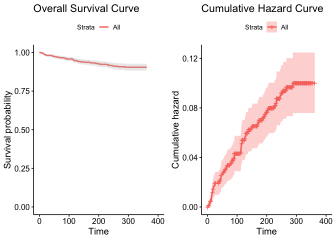
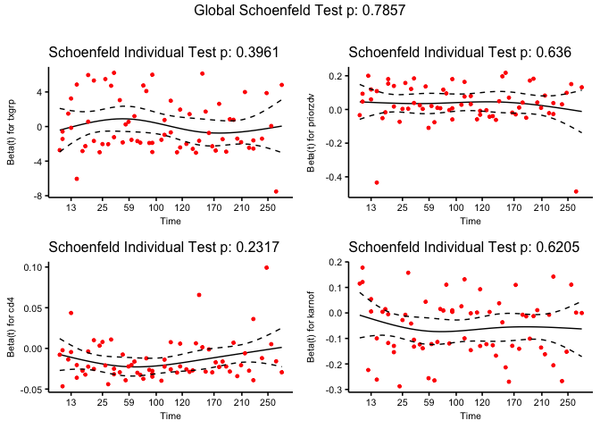

### Introduction:

The Human Immunideficiency Virus (HIV) targets CD4 cells (T cells), which are part of the immune system and help fight infections by recognizing infectious agents and signalling other cells in the immune system to respond (1). When CD4 cells are decreased, the ability to fight off infections is impaired. Acquired Immunideficiency Syndrome (AIDS) occurs when CD4 cell count (normall in the range of 500-1500 cells/mm) drops below 200 cells/mm. Because HIV is a retrovirus, upon infection, the human genome is altered to permanently include the HIV virus and there is no permanent cure. Common treatment for HIV is antiretroviral therapy, a combination of multiple drugs intended to keep the amount of HIV in the blood low by preventing existing HIV from multiplying (2). Previous trials with drug combinations have found that three-drug regiments including one protease inhibitor (inhibit enzymes that process proteins necessary for HIV replication) and two nucleoside analogs (molecules that are similar to natural nucleotides but terminate DNA replication when used). The treatment consisting of indinavir, zidovudine, and lamivudine was shown to decrease plasma HIV RNA concentrations to under 500 copies/ml in the majority of patients (the threshold for undetectable levels is 400 copes/ml (3)). To determine the efficacy and safety of this proposed regimen, a clinical study by Hammer et al. was run comparing the control regimen (zidovudine, lamivudine) to the treatment regimen (indinavor, zidovudine, lamivudine) (4). 

HIV-infected patients enrolled in the study were required to have at most a CD4 count of 200 cells/mm and at least three months of prior zidovudine therapy. The study was stratified on CD4 levels  50 cells/ml or lower and levels 51-200 cells/ml, and the study was designed to have 40% of all enrolled patients had 50 or fewer CD4 cells per milliliter. To measure efficacy, the outcome of interest was time to a AIDS-defining event or death (4). This is an analysis of the efficacy of the three-drug therapy, with the goal of building a Cox Proportional Hazards model to model the survival of patients. 

### Methods:

Data for this analysis were taken from the Hammer et al. study. An initial data exploration used a chi-squared test of proportions on demographics of participants and the response (AIDS/Death) associated with various explanatory variables.

An initial Cox PH model was built using forward step-wise selection. A Cox model was built for each individual covariate, and covariates were added to a new model in order of most to least significant according to the p-value from a Wald test, forming a series of nested models while the likelihood ratio test for adding the last covariate showed significance. Because strat2 and cd4 convey very similar information, only cd4 was considered for model building. Complimentary log log curves, as well as Kaplan-Meier survival curves, of individual covariates in the model were used as an initial assesment of the proportional hazards assumption. The proportional hazard assumption in resulting model from forward selection was assessed with the cox.zph function. Models with CD4 as a covariate was compared to similar models built substituting a categorical CD4 variable (groups 50 cells/ml apart) for the continuous CD4 variable. The use of a categorical versus linear covariate was analyzed by examining the linearlity of the log(HR) between categorical groups. The two models were also assessed for fit using AIC and BIC. An additional model was built using intuition and background knowledge of medical treatments. This model was assess for fit using AIC, BIC, and a c index by building several models on a training set (75% of whole dataset), and the statistics were measured with a testing set (25% of whole dataset).Proportional hazards were confirmed using cox.zph. 

### Results:

Statistical analyses were conducted to assess the survival of the patients.

1. Patient Selection

There was an unequal representation of demographics in the 851 patients in the study (Figure 1). There was a significant difference in the gender distribution (Figure 1A) as well as race/ethnicity (Figure 1B). The most higly represened demographic was male, white non-hispanic followed by male, black non-hispanic (Figure 1C). 

<!-- -->

Figure 1: Distribution of sex (A), and race/ethnicity (B), sex and race/ethnicity (C). All three variables resulted in a p-value of 2.2e-16 in a chi-squared test of proportions. 

2. Significant Variables

The difference in proportions of patients who recieve AIDS diagnoses or die for various explanatory variables was assessed. There is a significant difference in the proportion of individuals who develop AIDS or die across the different Karnofsky scale groups (Figure 2A), CD4 categorical groups (Figure 2B), and treatment groups (Figure 2C). There is no significant difference in the proportion of individuals who develop AIDS or die across the different drug usage groups (p=0.7401) or hemophilia groups (p=0.918). 

<!-- -->

Figue 2. Proportions of patients who recieve AIDS diagnoses or die for Karnofsky score (A), CD4 (B), and Treatment (C) groups. A chi-squared test of proportions demostrated that the proportion of individuals who experience the event is not equal across different groups (Karnofsky: p=2.047e-09, CD4: p=9.129e-08, Treatment: p=0.004594).

3. Cox Models

A survival curve and cumulative hazard curve of the whole patient population show a slow decrease in survival probability over time (Figure 3).

<!-- -->

Figure 3: Survival curve and cumulative hazard curve of patient population.

The individual covariates txgrp, karnof, cd4, and strat2 have significant correlation coefficients (Table 1). The order of covariates in order of most to least significant is karnof, cd4, txgrp, strat2, age, ivdrug, prior zdv, sex, hemophil and raceth. Because strat2 conveys very similar information to cd4, I will only use cd4 because it is more significant. The survival probabilities of patients differs across all variables (txgrp, karnof, cd4). When treatment is the variable, the complimentary log log curves clearly do not cross, indication proportional hazards. When Karnofsky score is the variable, scores of 90 and 100 overlap a bit, but are essentially the same curve (and the confidence intervals are very large and overlapping), so proportional hazards holds. When CD4 is the variable, the curves for the higher categories have some overlap, but once again have extremely large and overlapping confidence intervals, so we can assume proportional hazards (Figure 4).


```
##             beta HR (95% CI for HR) wald.test p.value
## txgrp      -0.76   0.47 (0.28-0.77)       8.9  0.0028
## sex          0.2     1.2 (0.65-2.3)      0.39    0.53
## strat2      -1.3   0.27 (0.16-0.45)        25 5.5e-07
## raceth    0.0036       1 (0.77-1.3)         0    0.98
## ivdrug     -0.13    0.88 (0.62-1.2)      0.52    0.47
## hemophil    0.27     1.3 (0.41-4.2)      0.21    0.65
## karnof    -0.081    0.92 (0.9-0.95)        34 6.9e-09
## cd4       -0.017   0.98 (0.98-0.99)        32 1.9e-08
## priorzdv -0.0032         1 (0.99-1)      0.48    0.49
## age        0.017         1 (0.99-1)       1.8    0.18
```

Table 1: Estimates and Wald test for individual covariates. 

<!-- --><!-- --><!-- -->

Figure 4: Kaplan-Meier survival curves and complimentary log log curves for variables treatment group, Karnofsky, and CD4. 


The model built using forwards selection resulted in only the covariates txgrp, karnof and cd4 (Model 1). Replacing CD4 in Model 1 with a categorical CD4 variable (<=50, 51-100, 101-150, 151-200, >200) revealed that the log(HR) was not constant between the groups of equal size and thus CD4 is not a linear variable. But, when assesed with AIC and BIC values, the linear model (AIC=836.0552, BIC=850.2945) was lower than that of the categorical model (AIC=839.3151, BIC=867.7936), indicating that the linear model provided a better fit. 

Several models with interaction terms building upon Model 1 were tested and many were found to be insignificant. Variables to be interacted were determined based on prior knowledge on treatments. Because prior treatment can affect response to current treatment, txgrp and priorzdv were interacted (Table 2) and found to be near significant (p=0.058) when compared to Model 1 with a likelihood ratio test. 


```
## # A tibble: 5 x 7
##   term           estimate std.error statistic    p.value conf.low conf.high
##   <chr>             <dbl>     <dbl>     <dbl>      <dbl>    <dbl>     <dbl>
## 1 txgrp            0.0484   0.397       0.122 0.903      -0.730     0.826  
## 2 priorzdv         0.0347   0.0164      2.12  0.0338      0.00266   0.0668 
## 3 karnof          -0.0559   0.0141     -3.98  0.0000694  -0.0835   -0.0284 
## 4 cd4             -0.0146   0.00309    -4.72  0.00000234 -0.0206   -0.00852
## 5 txgrp:priorzdv  -0.0288   0.0138     -2.08  0.0375     -0.0559   -0.00167
```

Table 2: Estimates and significance levels for a Cox model (Model 2) using treatment group interacting with prior zdv treatment, Karnofsky, and CD4 (continuous).

4. Model Assessment

The AIC of Model 2 was 834.35, lower than that of the previous model, but the BIC was 858.08, greater than that of the previous model. Analysis of the c index revealed that the index of Model 1 (0.7759482) was less than that of Model 2 (0.7814926), indicating Model 2 is a better fit. Repeated simulations of building models with 75% of the data, and calculating AIC, BIC, and c index with the remaining data revealed that Model 2 had a lower AIC and c index on average (Figure 5). Analysis of Model 2 with cox.zph revealed proportional hazards (Table 3). 


<!-- -->

Figure 5: Distributions of simulated AIC (A), BIC (B), and cindex (C) values. Lower AIC and higher cindex in Model 2 indicates a better fit. 


```
##                    rho chisq     p
## txgrp          -0.1098 0.720 0.396
## priorzdv       -0.0658 0.224 0.636
## karnof         -0.0602 0.245 0.621
## cd4             0.1518 1.431 0.232
## txgrp:priorzdv  0.0755 0.328 0.567
## GLOBAL              NA 2.439 0.786
```

Table 3: cox.zph output for the model. All p-values are insignificant. 

### Discussion:

1. Patient Selection

The statistically significant disproportion of demographics represented in the clinical study suggests that the results cannot be generalized to the whole population. The results are most applicable to white, non-hispanic males. 

2. Model Building 

The Cox Proportional Hazards model describes the relationship between survival of an individual based on one or more explanatory variables (covariates). Thus, it can help estimate the effectiveness of treatment on survival and can provide an estimate of the hazard function (the likelihood of the event occuring at any given point in time) based on the covariates. The Cox model relies on the assumption that there are proportional hazards (the ratio of hazards for any two individuals is constant over time). This is because the Cox model is built on the following: $h_i(t) = h_0(t)e^{\beta x_i}$ for the $i$th individual. Then, the hazard ratio for individuals $i$ and $j$ is $\frac{h_0(t)e^{\beta x_i}}{h_0(t)e^{\beta x_j}}=e^{\beta(x_i-x_j)}$, so there are proportional hazards for any two individuals, independent of time. Additionally, $e^{\beta_k}$ can be interpreted as the hazard ratio associated with a one unit increase in covariate $k$. Because the Cox model is built upon a proportional hazards assumption, it is important to investigate and confirm whether there are proportional hazards in a proposed model. 

Under the proportional hazards assumption, the $\beta$ coefficients are determined with maximum likelihoodestimation, meaning we estimate the parameters to maximize the likelihood of the observed data. The likelihoodof the $i$th individual dying at $t_i$ (given there is at least one death at $t_i$) is $\frac{P(i^{th} \text{ indiv w/}x_i \text{ dies at } t_i)}{P(\text{at least one death at } t_i)} = \frac{e^{\beta x_i}}{\sum_{k:t_k>t_i}e^{\beta x_k}}$. The likelihood of $\beta$ is equal to the product of the likelihood s of all the individuals who have death times recorded, so $\delta_i$ serves as an indicator for events. 

\begin{eqnarray*}
L(\beta) &=& \prod_{i=1}^{n} {(\frac{e^{\beta x_i}}{\sum_{k:t_k>t_i}e^{\beta x_k}})}^{\delta_i}\\
ln(L(\beta)) &=& \sum_{i=1}^{n}\delta_i (\beta x_i - ln(\sum_{k:t_k>t_i}e^{\beta x_k}))\\
\end{eqnarray*}

The log-likelihood is a function of only the coefficients and observed data with no assumptions on the distribution of event times. $b=\hat{\beta}$ is determined by setting partial derivatives of the log-likelihood with respect to $\beta$ equal to 0. When proportional hazards are violated, the hazard ratio is dependent on time. Thus, $h_i(t)=h_0(t)e^{\beta_1 x_{i1} + \beta_2(t) x_{i2}(t)}$, where $\beta_1$ and $\beta_2$ are the coefficients of time-fixed and time-varying covariates respectively. Thus, the hazard ratio is no longer time-independent. To test whether a covariate should enter the model as independent of time, we want to test the hypothesis $\beta_2 = 0$. We can no longer use the likelihood to calculate $\beta_2$ estimates because $\beta$ is now a function of time and we cannot maximize its likelihood (5). 

The Schoenfeld residual for each covariate is equal to the difference between the observed and expected value of the covariate at each event time. Schoenfeld showed that the residuals are asymptotically uncorrelated and have an expected value of 0 under the Cox model. 

Because maximum likelihood fails with time dependencies, Schoenfeld residuals are used. The R function cox.zph tests the proportionality of all predictors by creating interactions with time. It does this by correlating the Schoenfeld residuals against transformed time to test for independence between the residuals and time. Any correlation between the residuals and time indicate non-proportional hazards. Having very small p values indicates that the residuals are not constant over time, providing evidence the proportional hazards assumption is violated. 

The final model (Model 2) uses treatment group, prior zdv, cd4, and treatment group and prior zdv interacting. The estimate for treatment group coefficient is 0.0484 (-0.730, 0.826) with a p-value of 0.903. There is no evidence to show that the estimate for the treatment group coefficient to be different from 0, indicating that the hazard ratio between the two treatment groups is the same. The estimate for prior zdv coefficient is 0.0347 (0.00266, 0.0668) with a p-value of 0.0338. Thus we can conclude that the a one unit increase in months of prior zdv treatment is associated with an 1.035 factor increase of the hazard. The estimate for the treatment group and prior zdv interaction coefficient is -0.288 (-0.0559, -0.00167) with a p-value of 0.0375. This indicates that the effects of treatment changes based on the length of prior zdv treatment. The hazard for an individual with IDV treatment is approximately three quarters of the hazard for an individual without IDV treatment with the same amount of prior zdv treatment. The estimate for the coefficient of Karnofsky score is -0.559 (-0.0835, -0.0284) with a p-value of 0.000684. The Karnofsky score is reported in increments of 10, and a 10 unit increase in Karnofsky score is associated with a 0.0037 factor change in hazard. Lastly, the estimate for the coefficient for CD4 is -0.146 (-0.020, -0.00852) with a p-value of 0.00000234. A one unit increase in CD4 cell count is associate with a .864 factor change in hazard. Increases in both Karnofsky score and CD4 decrease the hazard, while an increase in prior zdv increases the hazard. 

3. Model Assesment 

AIC can be used to compare models, and a lower AIC value corresponds to a better fit. AIC also on likelihood s, but does correct for differences in degrees of freedom so it is comparable between models and can be used to estimate whether one model provides a better fit. BIC is similar to AIC but penalizes model complexity more heavily. Models that minimize AIC/BIC should be selected. The c index denotes the frequencies of concordant pairs among all pairs of subjects. Thus a higher c index is indicative of a better predictive model. A lower AIC and higher c index for this model over other models indicates that it is a better fit. Although the BIC is higher than that of other models, the selected model has more degrees of freedom, explaining the higher BIC value. Since two of the three measured used to assess the fit of models suggest that the selected model is better than other models, the higher BIC value is ignored. 

Model 2 was also assessed for proportional hazards with cox.zph. The p-values for all covariates are insignificant, indicating that we cannot reject the hypothesis that the correlation between the Schoenfeld residuals and time is zero. Thus, all the covariates are not time-dependent and that the proportional hazards assumption is met with the model (Table 3, Figure 6). 

<!-- -->

Figure 6: Schoenfeld residuals for all covariates plotted against time. Correlation is 0 for all covariates. 

### References:

(1) hiv.va.gov/patient/diagnosis/labs-CD4-count.asp

(2) aidsinfo.nih.gov/understanding-hiv-aids/fact-sheets/21/51/hiv-treatment--the-basics#

(3) https://aidsinfo.nih.gov/guidelines/html/1/adult-and-adolescent-arv/458/plasma-hiv-1-rna--viral-load--and-cd4-count-monitoring

(4) https://www.nejm.org/doi/full/10.1056/NEJM200103083441003

(5) https://www.jstor.org/stable/pdf/2337123.pdf
